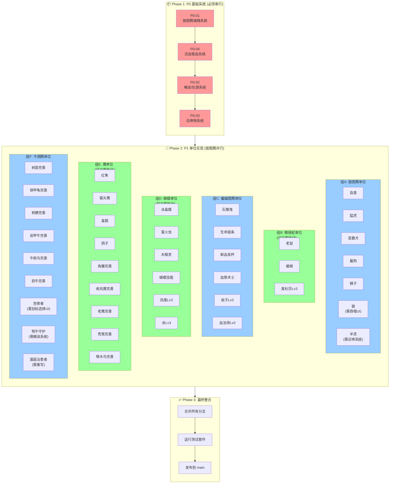
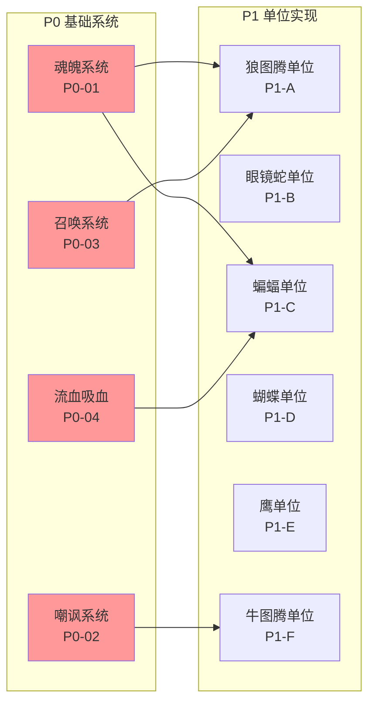
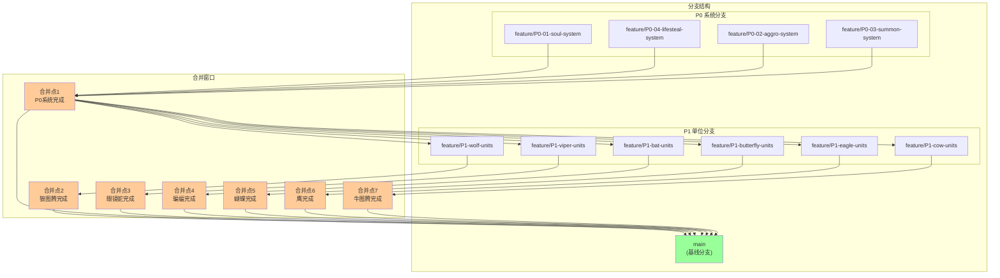
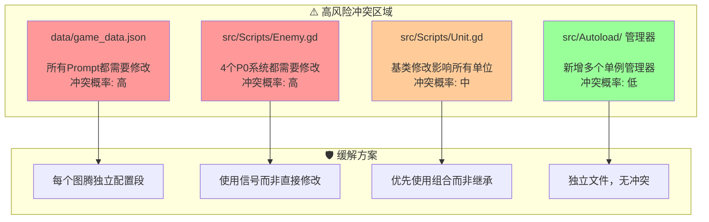

# Jules 执行流程图

> 由系统架构师（陈睿）基于审核报告生成
> 生成时间: 2026-02-19

## 1. 总体执行流程



## 2. 依赖关系图



## 3. 分支合并策略



## 4. 高风险冲突区域



## 5. 执行时间表 (建议)

| 阶段 | 任务 | 预估时间 | 依赖 | 合并点 |
|-----|------|---------|------|--------|
| **Phase 1** | | | | |
| | P0-01 狼图腾魂魄系统 | 2-3天 | 无 | M1 |
| | P0-04 流血吸血系统 | 2天 | P0-01 | M1 |
| | P0-02 嘲讽/仇恨系统 | 2-3天 | P0-04 | M1 |
| | P0-03 召唤物系统 | 2天 | P0-02 | M1 |
| **Phase 2** | | | | |
| | P1-A 狼图腾单位群 | 4-5天 | P0-01, P0-03 | M2 |
| | P1-B 眼镜蛇单位群 | 2-3天 | 无 | M3 |
| | P1-C 蝙蝠图腾单位群 | 4-5天 | P0-04 | M4 |
| | P1-D 蝴蝶单位群 | 3-4天 | 无 | M5 |
| | P1-E 鹰单位群 | 4-5天 | 无 | M6 |
| | P1-F 牛图腾单位群 | 4-5天 | P0-02 | M7 |
| **Phase 3** | | | | |
| | 最终整合测试 | 2-3天 | M2-M7 | Release |

**总计预估**: 约 4-5 周

## 6. Jules 命令参考

```bash
# ========== Phase 1: P0 基础系统 ==========

# P0-01: 狼图腾魂魄系统
jules --prompt="docs/jules_prompts/P0_01_wolf_totem_soul_system.md" \
      --branch="feature/P0-01-soul-system" \
      --reviewers="@game-designer,@system-architect"

# P0-04: 流血吸血系统
jules --prompt="docs/jules_prompts/P0_04_bleed_lifesteal_system.md" \
      --branch="feature/P0-04-lifesteal" \
      --base="feature/P0-01-soul-system"

# P0-02: 嘲讽/仇恨系统
jules --prompt="docs/jules_prompts/P0_02_taunt_aggro_system.md" \
      --branch="feature/P0-02-aggro-system" \
      --base="feature/P0-04-lifesteal"

# P0-03: 召唤物系统
jules --prompt="docs/jules_prompts/P0_03_summon_system.md" \
      --branch="feature/P0-03-summon-system" \
      --base="feature/P0-02-aggro-system"

# ========== Phase 2: P1 单位实现 ==========

# P1-A: 狼图腾单位群
jules --prompt="docs/jules_prompts/P1_01_wolf_units_implementation.md" \
      --branch="feature/P1-wolf-units" \
      --base="main"

# P1-B: 眼镜蛇单位群
jules --prompt="docs/jules_prompts/P1_02_viper_cobra_units.md" \
      --branch="feature/P1-viper-units" \
      --base="main"

# P1-C: 蝙蝠图腾单位群
jules --prompt="docs/jules_prompts/P1_03_bat_totem_units.md" \
      --branch="feature/P1-bat-units" \
      --base="main"

# P1-D: 蝴蝶图腾单位群
jules --prompt="docs/jules_prompts/P1_04_butterfly_units.md" \
      --branch="feature/P1-butterfly-units" \
      --base="main"

# P1-E: 鹰单位群
jules --prompt="docs/jules_prompts/P1_05_eagle_units.md" \
      --branch="feature/P1-eagle-units" \
      --base="main"

# P1-F: 牛图腾单位群
jules --prompt="docs/jules_prompts/P1_06_cow_totem_units.md" \
      --branch="feature/P1-cow-units" \
      --base="main"
```

## 7. 关键检查点

在每个合并点之前，需要验证以下内容：

### M1 (P0系统完成)
- [ ] SoulManager 单例工作正常
- [ ] AggroManager 嘲讽逻辑正确
- [ ] SummonManager 生命周期管理正确
- [ ] LifestealManager 吸血计算正确
- [ ] 所有P0系统单元测试通过

### M2-M7 (各图腾单位完成)
- [ ] 新单位配置文件正确添加
- [ ] 单位技能效果符合设计文档
- [ ] 与其他单位的协同效果正常
- [ ] 无性能问题(帧率下降 < 5%)

### Release (最终发布)
- [ ] 所有单元测试通过
- [ ] 集成测试通过
- [ ] 性能测试通过
- [ ] 代码审查完成

---

*此流程图由系统架构师基于审核报告生成，如有变更需要更新*
